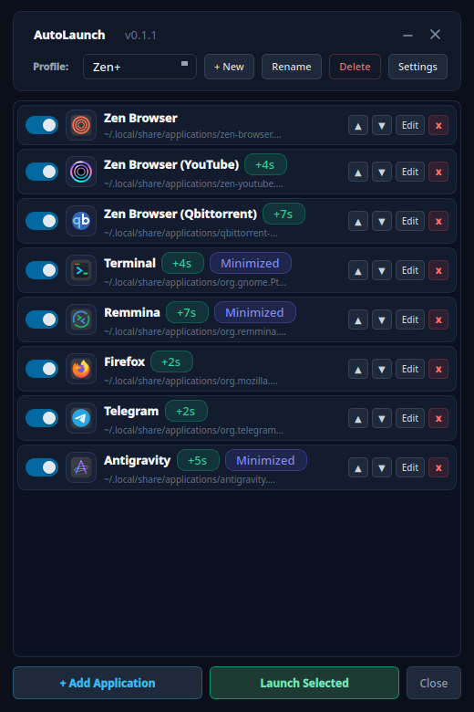
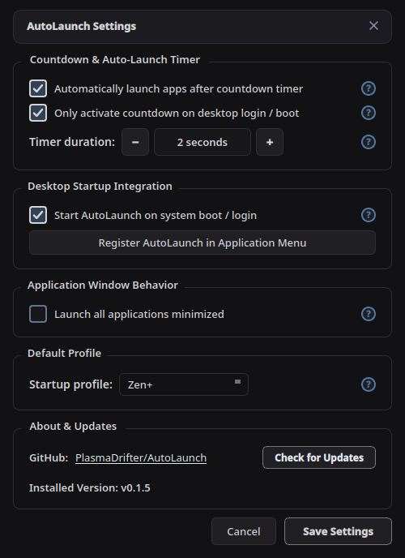
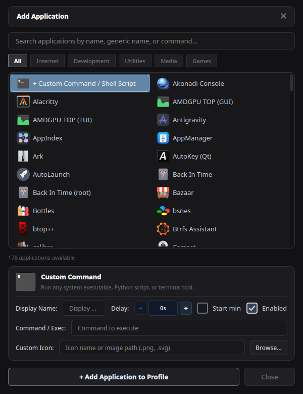

# AutoLaunch

AutoLaunch is a modern, native PyQt6 desktop application designed for Linux desktop environments (optimized for KDE Plasma 6 Wayland and X11). It manages and coordinates startup applications on user login, providing an interactive checklist, profiles, configurable countdown timer, startup delay sequencing, window minimization controls, and clean self-termination upon launching.

<p align="center">
  
  &nbsp;&nbsp;
  
  &nbsp;&nbsp;
  
</p>

---

## Key Features

- **Desktop Boot Autostart**: Seamlessly integrates with standard FreeDesktop autostart specifications (`~/.config/autostart/autolaunch.desktop`) using dynamic runtime environment paths without hardcoded user directories.
- **Application Discovery**: Automatically scans and parses installed system and user `.desktop` entries across standard XDG locations and Flatpak installations with real-time search filtering.
- **Native Window & Icon Fidelity**: Uses `gtk-launch` and `gio launch` for desktop applications to ensure Wayland compositors (such as KWin) correctly associate running application windows with their `.desktop` specifications, preserving customized taskbar and titlebar icons (e.g. separate browser profiles or web app wrappers).
- **Profiles**: Full profile support (Default, Work, Gaming, etc.) allowing creation, renaming, switching, and deletion of custom application sets.
- **Countdown Timer**: Automatically launches active profile applications after a configurable countdown (default 5-7 seconds) unless paused or cancelled. If cancelled, AutoLaunch remains open for manual inspection.
- **Precision Stepper Controls**: Convenient plus and minus stepper controls for startup delays and countdown durations without requiring manual numeric keyboard entry.
- **Per-App Startup Delays**: Individual applications can have staggered delays (0 to 300 seconds) to prevent disk and network congestion during session initialization.
- **Window Minimization**: Support for launching applications minimized, both per application and as a global policy, leveraging asynchronous compositor controls (`kdotool windowminimize`) under KDE Plasma Wayland.
- **Activity Preservation**: Multi-activity support ensuring the desktop environment maintains the user's starting activity even when applications assigned to other activities are spawned.
- **Modern Dark Interface**: Clean obsidian dark theme with rounded cards, custom vector glyphs, animated toggle switches, status badges, and zero emojis.
- **Clean Self-Termination**: Closes immediately after launching all selected applications in detached background sessions.

---

## Requirements

- Linux operating system (tested on Nobara / Fedora Linux with KDE Plasma 6 Wayland)
- Python 3.10+
- PyQt6 (`python3 -m pip install PyQt6` or distro package `python3-pyqt6`)
- `kdotool` (optional, recommended on KDE Plasma for Wayland window minimization)

---

## Installation

Clone the repository and run the setup script:

```bash
git clone https://github.com/PlasmaDrifter/AutoLaunch.git ~/Source/AutoLaunch
cd ~/Source/AutoLaunch
./install.sh
```

The installer configures:
- `~/.local/bin/autolaunch` executable wrapper script
- `~/.local/share/applications/autolaunch.desktop` application menu entry
- `~/.config/autostart/autolaunch.desktop` desktop autostart entry
- Vector application icons in `~/.local/share/icons/hicolor/scalable/apps/`

---

## Usage

### Interactive GUI Mode
```bash
autolaunch
```
or launch from the terminal directly:
```bash
python3 autolaunch.py
```

### Configuration Mode (Skips countdown timer)
```bash
autolaunch --config
```

### Headless Mode (Launches active profile immediately without showing GUI)
```bash
autolaunch --headless
```

### Desktop Autostart Mode
```bash
autolaunch --autostart
```

---

## Configuration

Settings and profiles are stored in:
`~/.config/autolaunch/config.json`

Example configuration structure:
```json
{
  "active_profile": "Default",
  "countdown_seconds": 5,
  "enable_countdown": true,
  "launch_minimized": false,
  "autostart_enabled": true,
  "profiles": {
    "Default": {
      "apps": [
        {
          "id": "zen-browser.desktop",
          "name": "Zen Browser",
          "command": "zen",
          "desktop_file": "~/.local/share/applications/zen-browser.desktop",
          "icon": "zen-browser",
          "enabled": true,
          "delay_seconds": 0,
          "start_minimized": false
        }
      ]
    }
  }
}
```

---

## Running Tests

Execute the unit test suite:

```bash
python3 -m unittest discover -s tests -p "test_*.py" -v
```

---

## License

MIT License. See project files for details.

---

## Community & Discussions

Got questions, setup ideas, or feedback?

* Join our subreddit at [**r/PlasmaDrifterProjects**](https://reddit.com/r/PlasmaDrifterProjects) to discuss updates, get support, and share configurations.
* Contact directly via email at [**plasmadrifter121@gmail.com**](mailto:plasmadrifter121@gmail.com).
